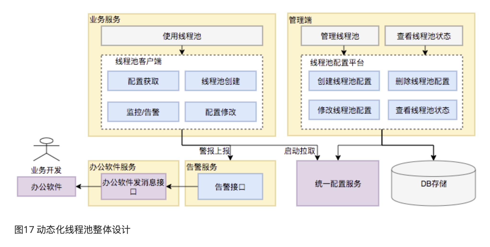
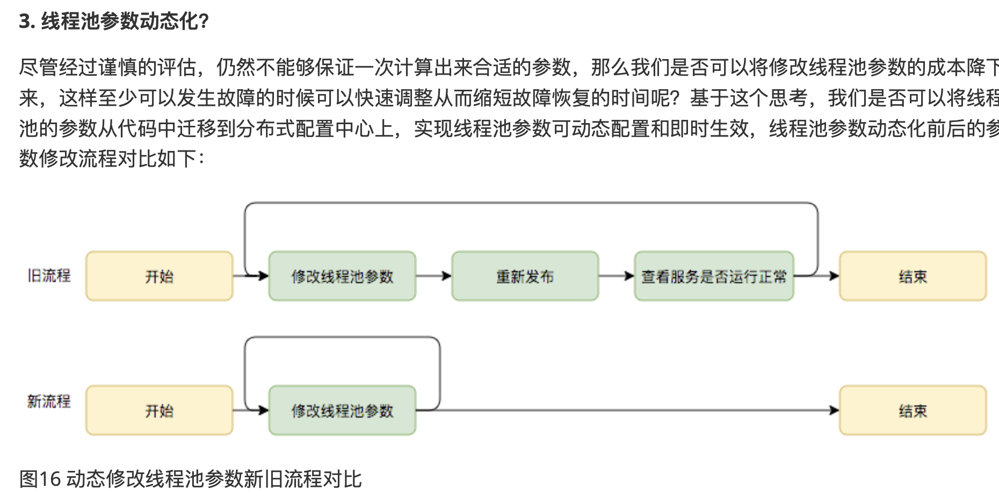

# Dynamic Thread Pool
• Developed a dynamic thread pool with real-time adjustments using Java and Spring Boot. Utilized Redis as a registry and integrated Prometheus and Grafana for monitoring, significantly boosting multithreaded processing efficiency and reliability

# 自我思考问题
## 作为一个组件，我如何使其能够和其他团队进行复用？以及其他团队的线程池是如何注册到我的动态线程池中的？
## 我的Dynamic线程池组件，它是在项目上线，投入实际使用中，根据实际情况来调整吗？
## 我的项目如果部署在多个server上，那么线程池会有什么变化吗？如果我动态的更新我的线程池，会确保所有server上都能更新吗？
## 我有一个自定以的动态线程池组件，我想加入监控和报警功能，使用Prometheus + Grafana，能够做到吗？ 我的动态线程池已经有自定义的一个前端页面

# 押题
## 1. Metrics
* 这个Dynamic Thread Pool的Metrics有哪些？（根据哪些metrics来进行动态调整的？）


* Signal 的 limits是什么？

## 2. Prometheus 和 Grafana用来干嘛？
### Prometheus Monitoring了什么？
### 什么时候Alarm？
* Prometheus进行metrics的监听，Grafana进行dashboard的设计
* 1. 核心运行指标（必须监控）：
```java
    // 线程相关
- thread_pool_active_count        // 活跃线程数
- thread_pool_size               // 当前线程数
- thread_pool_core_size          // 核心线程数
- thread_pool_max_size           // 最大线程数

// 队列相关
- thread_pool_queue_size         // 当前队列大小
- thread_pool_queue_remaining    // 队列剩余容量
- thread_pool_queue_capacity     // 队列总容量
```
* 2. 任务执行指标（性能监控）：
```java
// 任务统计
- thread_pool_completed_tasks    // 已完成任务数
- thread_pool_total_tasks        // 总任务数
- thread_pool_reject_count       // 拒绝任务数

// 延迟指标
- thread_pool_task_wait_time     // 任务等待时间
- thread_pool_task_execute_time  // 任务执行时间
```
* 3. 告警指标（系统稳定性）：
```java
// 异常指标
- thread_pool_reject_rate        // 拒绝率
- thread_pool_timeout_count      // 超时次数
- thread_pool_error_count        // 错误次数
```
* 为什么选择这些指标：
    * 活跃线程数反映当前负载
    * 队列大小反映积压情况
    * 拒绝率反映系统压力
    * 执行时间反映性能状况

* 线程池监控
    * 除了参数动态化之外，为了更好地使用线程池，我们需要对线程池的运行状况有感知，比如当前线程池的负载是怎么样的?分配的资源够不够用?任务的执行情况是怎么样的?是⻓任务还是短任务?基于对这些问题的思考，动态 化线程池提供了多个维度的监控和告警能力，包括:线程池活跃度、任务的执行Transaction(频率、耗时)、 Reject异常、线程池内部统计信息等等，既能帮助用户从多个维度分析线程池的使用情况，又能在出现问题第一时 间通知到用户，从而避免故障或加速故障恢复。
* 线程池负载关注的核心问题是:基于当前线程池参数分配的资源够不够。对于这个问题，我们可以从事前和事中两个⻆度来看。事前，线程池定义了“活跃度”这个概念，来让用户在发生Reject异常之前能够感知线程池负载问题， 线程池活跃度计算公式为:线程池活跃度 = activeCount/maximumPoolSize。这个公式代表当活跃线程数趋向于 maximumPoolSize的时候，代表线程负载趋高。事中，也可以从两方面来看线程池的过载判定条件，一个是发生 了Reject异常，一个是队列中有等待任务(支持定制阈值)。以上两种情况发生了都会触发告警，告警信息会通过 大象推送给服务所关联的负责人。

## 3. 为什么使用Redis？
* 为什么使用Redis来作为Registry 
## 4. Concurrency Control
* 如何进行的Concurrency Control？

## 5. 如何实现的component复用？
* 是如何在share给其他组的？
    * 需要documentation吗？
    * 如何integrate到其他地方的？
    * 其他组使用的输入输出？
## 6. Benefits
* 为什么要设计这样的dynamic thread pool?
* 他解决了什么问题？

## 7. What I do?
* 我做了哪些内容？
* 独立完成的步骤？与哪些组进行了对接？
* 如何确保能够integrate到其他组的application的？
### 做这个component的初衷是什么？（为了解决什么问题？）
* 线程池使用面临的核心的问题在于:线程池的参数并不好配置。一方面线程池的运行机制不是很好理解，配置合理 需要强依赖开发人员的个人经验和知识;另一方面，线程池执行的情况和任务类型相关性较大，IO密集型和CPU密集型的任务运行起来的情况差异非常大，这导致业界并没有一些成熟的经验策略帮助开发人员参考。
* 简化线程池配置:线程池构造参数有8个，但是最核心的是3个:corePoolSize、maximumPoolSize， workQueue，它们最大程度地决定了线程池的任务分配和线程分配策略。考虑到在实际应用中我们获取并发性的场景主要是两种:(1)并行执行子任务，提高响应速度。这种情况下，应该使用同步队列，没有什么任务应该被缓存下来，而是应该立即执行。(2)并行执行大批次任务，提升吞吐量。这种情况下，应该使用有界队列，使用队列去缓冲大批量的任务，队列容量必须声明，防止任务无限制堆积。所以线程池只需要提供这 三个关键参数的配置，并且提供两种队列的选择，就可以满足绝大多数的业务需求，Less is More。
* 参数可动态修改:为了解决参数不好配，修改参数成本高等问题。在Java线程池留有高扩展性的基础上，封装 线程池，允许线程池监听同步外部的消息，根据消息进行修改配置。将线程池的配置放置在平台侧，允许开发 同学简单的查看、修改线程池配置。
* 增加线程池监控:对某事物缺乏状态的观测，就对其改进无从下手。在线程池执行任务的生命周期添加监控能 力，帮助开发同学了解线程池状态。


* 动态调参:支持线程池参数动态调整、界面化操作;包括修改线程池核心大小、最大核心大小、队列⻓度等;参数 修改后及时生效。 任务监控:支持应用粒度、线程池粒度、任务粒度的Transaction监控;可以看到线程池的任务 执行情况、最大任务执行时间、平均任务执行时间、95/99线等。 负载告警:线程池队列任务积压到一定值的时候 会通过大象(美团内部通讯工具)告知应用开发负责人;当线程池负载数达到一定阈值的时候会通过大象告知应用 开发负责人。 操作监控:创建/修改和删除线程池都会通知到应用的开发负责人。 操作日志:可以查看线程池参数 的修改记录，谁在什么时候修改了线程池参数、修改前的参数值是什么。 权限校验:只有应用开发负责人才能够修 改应用的线程池参数。


## 8. Application Itself
* 如果我动态的更新我的线程池，会确保所有server上都能更新吗？(consistency)
* 我的项目如果部署在多个server上，那么线程池会有什么变化吗？
* Automatically 还是 Manually 还是 hybrid？
* 什么情况下（也就是metrics）
* 和之前相比，好处是什么？


# 背景
## 解决线程池使用面临的困难：
* 配置合理需要强依赖开发人员的个人经验和知识
* 线程池执行的情况和任务类型相关性较大
    * IO密集型(LinkedBlockingQueue):保单查询和搜索操作/邮件发送和通知 ==> 核心线程数较多：通常是CPU核心数的2倍以上 + 最大线程数可以更大：比如CPU核心数的4倍 【原因：IO线程大多在等待，适合多开线程提高吞吐量】
    * CPU密集型(ArrayBlockingQueue):保险费率计算 ==> 核心线程数较少：通常等于CPU核心数 + 最大线程数接近核心数：一般是CPU核心数+1 【原因：避免过多线程竞争CPU资源，减少上下文切换】
    * 快速处理(SynchronousQueue): 并行执行子任务，提高响应速度
## 出现过的问题（保险理赔高峰期系统崩溃事件）
* 某次自然灾害后，大量理赔申请涌入系统。每小时理赔请求从平常的200单激增到2000单
* 线程池配置不变，无法应对突发流量
* 大量理赔请求被拒绝，抛出RejectedExecutionException
## 思考/如何解决这个问题？

# 设计
## Metrics
### Monitor的指标
* active count: 活跃线程数
* max size: 最大线程数
* queue size: 队列大小
* completed task: 已完成任务数
* reject count: 拒绝任务数
* execute time: 执行时间
### Alert
* 活跃度报警: active/poolSize > 0.8
* 拒绝率报警: > 5%
* 队列使用率: queueSize / queueCapacity > 0.8

### 我能够调整的内容
* core thead count: 核心线程数
* max pool size: 最大线程数
* queue size: 队列的szie
corePoolSize、maximumPoolSize， workQueue 
## 整体的数据流向
* 配置初始化流程：
    * Application添加依赖
    * 通过application.yml配置线程池参数和redis连接信息
    * starter组件读取配置并初始化
* 数据上报流程：
    * starter每30s向Redis上报一次线程池状态
    * Redis保存所有线程池信息
* 配置更新流程：
    * Admin接收前端修改请求
    * 通过Redis topic发布更新通知
    * starter监听到更新并执行修改
* 监控告警流程：
    * Admin对接Prometheus和Grafana
    * 当资源负载>0.8时触发告警
    * 发送邮件给管理员

## Detail
### Thread Pool在redis存储
* RBucket存储单个Thread Pool的信息
* RList 存储所有Thread Pool的信息
* Key的样式: Enum.xxx_LIST_KEY + "_" + appname + "_" + poolName;

### 如何在application 1/application 2 中使用？
* 通过applicaiton.yml,这一步主要是用来建立redis连接池的
```java
dynamic:
    thread:
        pool:
            config:
                enabled: true,
                host:
                port:
```
### 如果设置的core thread数量小于当前 active的thread count会怎样？
* 不会中断正在执行的线程，而是会等待，处理完一个任务后，进行检查，如果超过就回收
* 不建议调小，除非长期的(e.g. 3 months)都闲置
* 减少监控的压力


# 团队协作
# 运维团队
* Prometheus和Grafana的接入配置:公司一套统一的监控平台地址
* Admin部署环境信息: 
* Admin端需要的Redis registry连接信息: xxx.redis.cache.azure.net:6380

# Potential Questions
## 为什么不自动扩容？
* 保险业务通常比较稳定，日常claims处理量可预测
* 突发情况通常有预警，在开学季会提前扩容（7-9）
* 降低系统复杂度
* 减少运维负担

## 我做了什么？
1. 核心功能
   - 配置动态更新
   - 监控指标采集
   
2. 基础设施
   - 配置中心对接
   - 监控系统集成
   - 基础告警支持
   
3. 通用能力
   - 扩展点定义
   - 运维接口
   - 文档支持

   