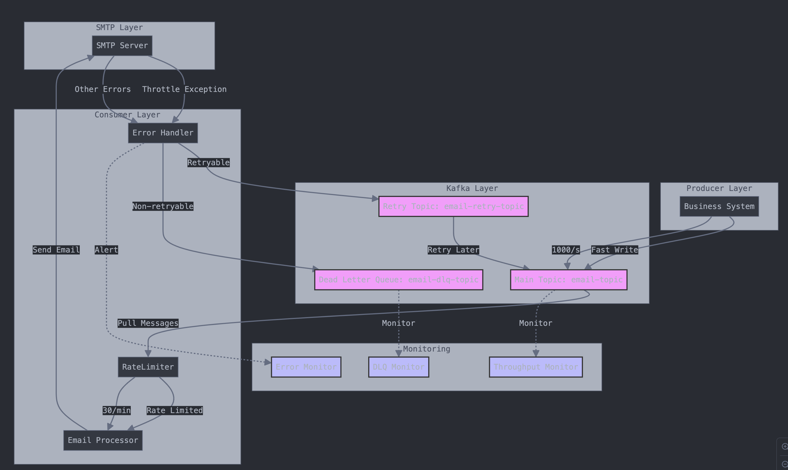

# 整体


## 思考
### Why Kafka?
* 问题场景
    * SMTP服务器限制每分钟只能发送30封邮件
    * 但业务系统可能在瞬间产生大量邮件请求(比如:用户注册验证码、订单通知等)
    * 直接发送可能超过SMTP限制导致失败
* Kafka的解决方案
    * 业务系统将邮件请求发送到Kafka (无速率限制)
    * 消费者以固定速率(比如每分钟30封)从Kafka消费并通过SMTP发送
    * 超出SMTP处理能力的请求会在Kafka中缓存，而不会丢失
* 效果
    * 业务系统可以快速处理大量邮件请求(高throughput)
    * SMTP发送速率保持在限制之内
    * 系统整体吞吐量得到提升，同时保证可靠性
### 具体实现流程
* Producer端
    * 比如秒级产生1000封邮件请求
    * 快速写入Kafka（毫秒级）
    * 业务系统无需等待邮件发送完成
    * 实现了高吞吐（high throughput）
* Kafka中间层
    * 可以缓存大量邮件消息
    * 消息持久化，保证可靠性
    * 支持消息堆积，不会丢失
* Consumer端
    * 符合SMTP服务器限制
    * 平稳发送，不会导致服务崩溃

### 职责和impact
* 负责邮件发送系统的架构设计和开发。通过Kafka消息队列实现了完整的邮件处理流程：

设计了三层队列架构：主发送队列(send-email)、重试队列(email-retry)和死信队列(email-dead-letter-queue)
在Consumer端实现了，有效控制SMTP服务器的发送频率
实现了完整的异常处理和重试机制，大大减少了throttle exception的发生
引入dead-letter-queue处理最终失败的邮件，提升了系统的可观测性

这个架构显著提升了系统的吞吐量和可靠性，同时保证了邮件服务的稳定性。"



### 分布式
* 三个server，三个smtp，一个kafka，在producer端进行partition和随机发送到不同的partition
* Key不指定，随机分配
* 每个Partition能保证fifo，整体不保证

# 指数退避重试策略
基本概念：


重试间隔时间会随着重试次数增加而指数增长
目的是避免立即重试对系统造成额外压力
通常会设置最大重试次数和最大等待时间


优势：


减少系统压力：

避免立即重试导致的资源浪费
给系统恢复的时间


提高成功率：

临时性故障有时间恢复
避免连续失败


防止惊群效应：

添加随机抖动避免同时重试
分散系统负载
```java 
@Slf4j
public class RetryStrategy {
    private static final int MAX_RETRY_ATTEMPTS = 3;
    private static final long INITIAL_WAIT_TIME = 1000; // 1秒
    private static final long MAX_WAIT_TIME = 60000;    // 1分钟
    
    /**
     * 基础指数退避策略
     */
    public long getBackoffTime(int retryCount) {
        // 2^重试次数 * 初始等待时间
        long waitTime = (long) Math.pow(2, retryCount) * INITIAL_WAIT_TIME;
        return Math.min(waitTime, MAX_WAIT_TIME);
    }
    
    /**
     * 带随机抖动的指数退避策略
     */
    public long getBackoffTimeWithJitter(int retryCount) {
        long backoffTime = getBackoffTime(retryCount);
        // 添加随机抖动，范围是0到backoffTime的20%
        long jitter = (long) (backoffTime * 0.2 * Math.random());
        return backoffTime + jitter;
    }
    
    /**
     * 实际使用示例
     */
    public void retryOperation() {
        int retryCount = 0;
        while (retryCount < MAX_RETRY_ATTEMPTS) {
            try {
                // 执行操作
                performOperation();
                return; // 成功则退出
                
            } catch (Exception e) {
                retryCount++;
                if (retryCount == MAX_RETRY_ATTEMPTS) {
                    log.error("Max retries reached", e);
                    throw new RuntimeException("Operation failed after max retries", e);
                }
                
                // 计算等待时间
                long waitTime = getBackoffTimeWithJitter(retryCount);
                log.warn("Retry {} after {}ms", retryCount, waitTime);
                
                try {
                    Thread.sleep(waitTime);
                } catch (InterruptedException ie) {
                    Thread.currentThread().interrupt();
                    break;
                }
            }
        }
    }
}

/**
 * 在邮件服务中使用
 */
@Service
public class EmailService {
    private final RetryStrategy retryStrategy = new RetryStrategy();
    
    @KafkaListener(topics = "email-retry")
    public void processRetry(String emailMessage) {
        EmailDTO email = JsonUtils.fromJson(emailMessage, EmailDTO.class);
        int retryCount = email.getRetryCount();
        
        try {
            // 获取退避时间
            long backoffTime = retryStrategy.getBackoffTimeWithJitter(retryCount);
            Thread.sleep(backoffTime);
            
            // 尝试发送邮件
            sendEmail(email);
            
        } catch (Exception e) {
            handleRetryFailure(email, e);
        }
    }
}
```

