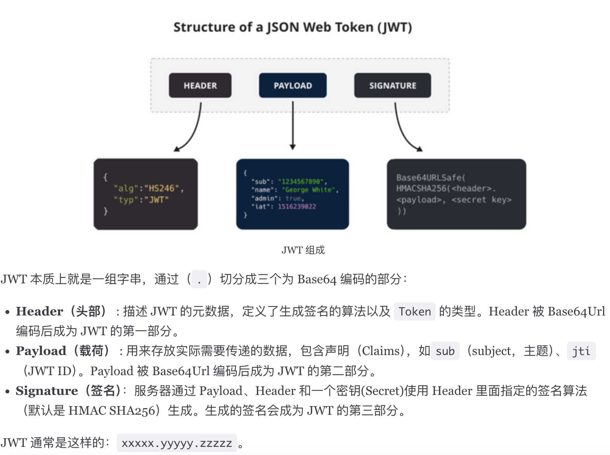
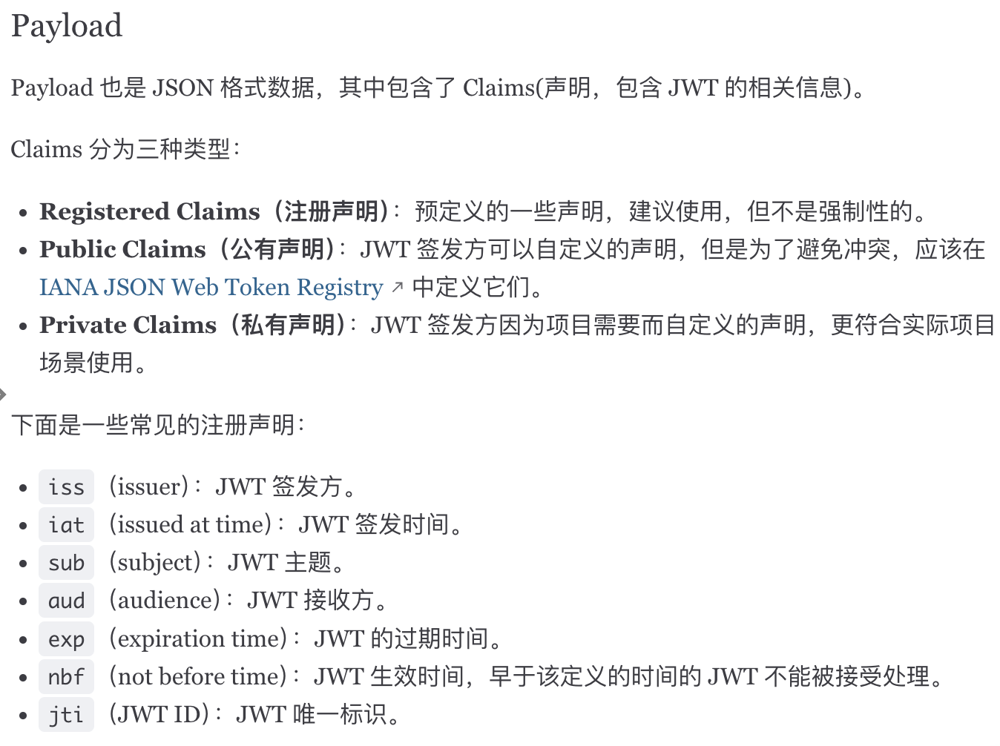
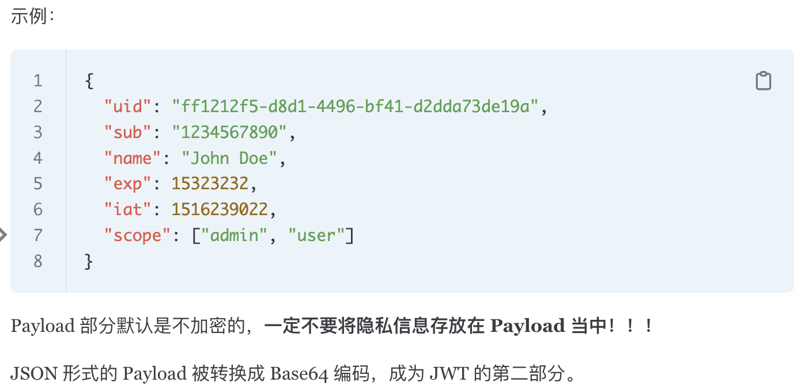
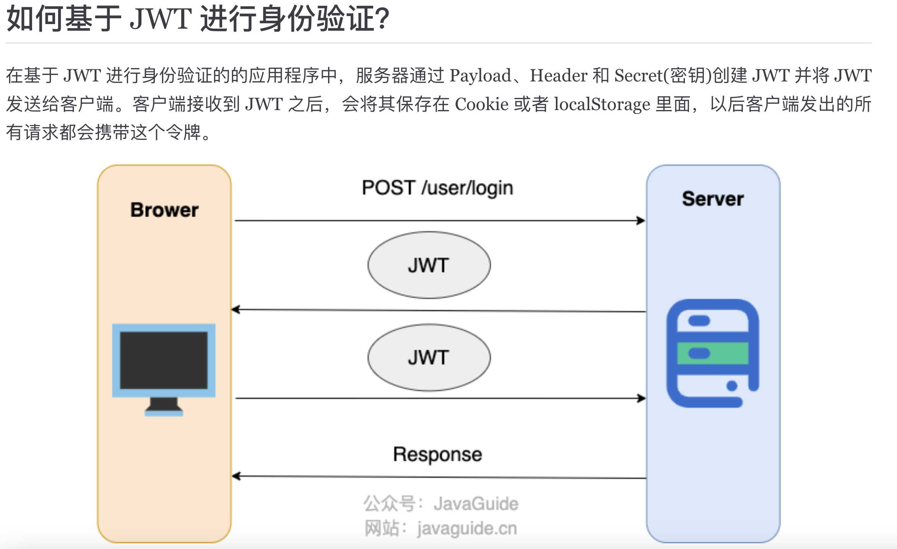
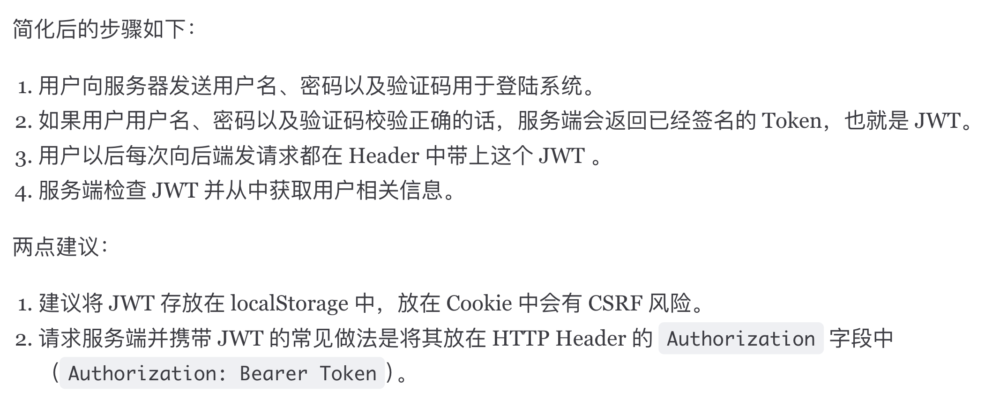
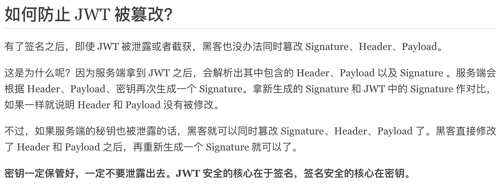
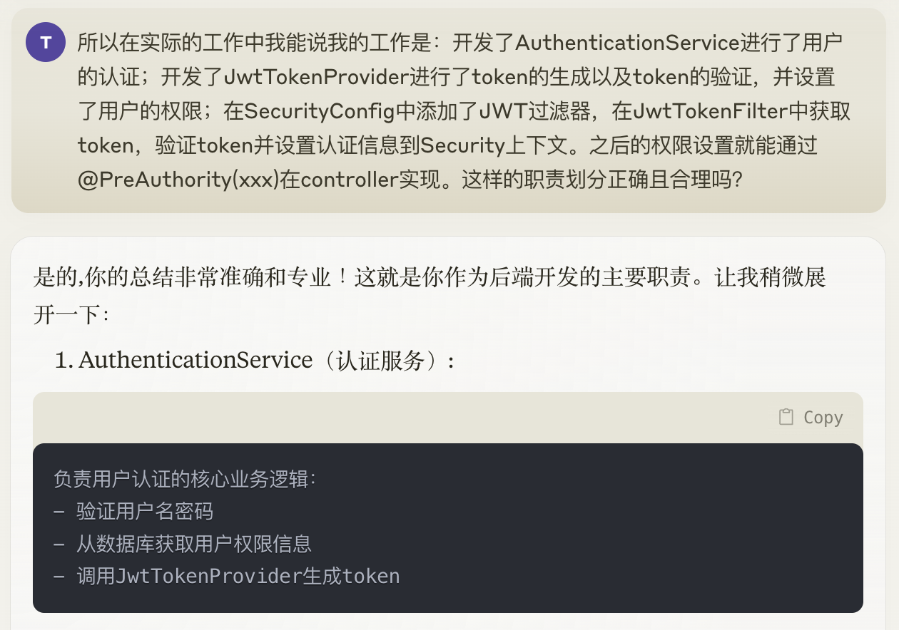
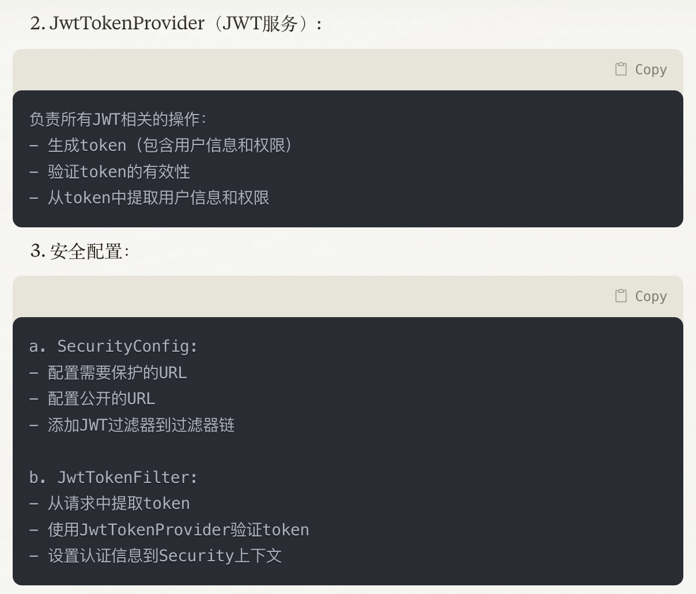
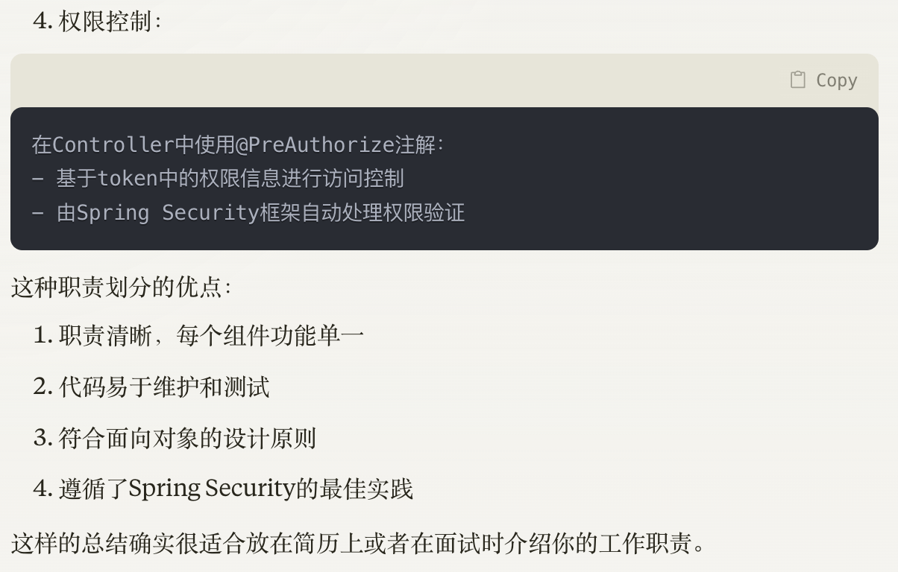

* Implemented Spring Security and JWT for secure account management, using RBAC to control access, displaying customized
pages and dynamic insurance pricing based on user roles, offering personalized solutions for enterprise and individual users.

# 整体图


## 完整的流程
### 我负责了什么？
#### 1. AuthenticationService
```
输入：
- LoginRequest (包含username和password)

处理：
- 查询数据库验证用户名密码
- 获取用户角色和对应权限
- 使用用户信息和权限生成JWT

输出：
- 成功：JWT token字符串
- 失败：抛出认证异常(如用户名不存在、密码错误等)
```

#### 2. JwtTokenProvider
```
A. 生成Token：
输入：
- username
- 权限列表(permissions)
- 其他需要放入payload的用户信息

处理：
- 创建JWT payload
- 设置过期时间
- 使用secret key签名

输出：
- JWT token字符串

B. 验证Token：
输入：
- JWT token字符串

处理：
- 验证签名
- 检查是否过期
- 解析payload获取用户信息和权限

输出：
- 成功：解析出的用户信息和权限
- 失败：抛出JWT相关异常
```
#### 3. 拦截时机是由 SecurityConfig  和 JwtTokenFilter
* SecurityConfig
    * 添加你的JWT过滤器
* JwtTokenFilter
    * 获取token [getTokenFromRequest(HttpServletRequest request)]
    * 验证token（使用你的JwtTokenProvider）[jwtTokenProvider.validateToken]
    * 设置认证信息到Security上下文[SecurityContextHolder]

# JWT知识
## JWT由哪些部分组成？




## 基于JWT的身份验证



## 防止JWT被篡改


# 故事
## 职责划分




